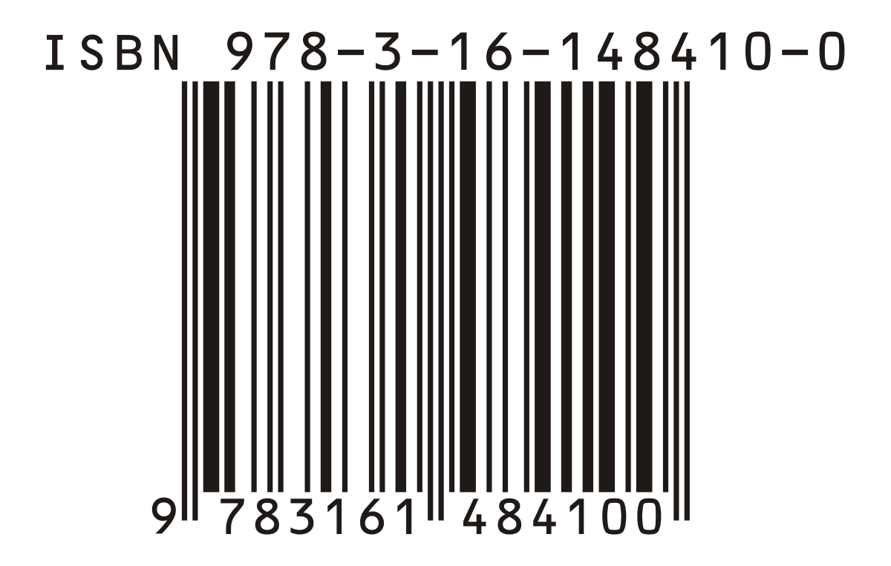

# International Standard Book Numbers

> "*An ISBN is assigned to each specific format of a book and never reused. Like golf, the rules are made-up and simple, but can be misinterpreted or applied incorrectly.*" - David Wogahn

The International Standard Book Number (ISBN) is a unique identifying number given to each published book. ISBNs assigned after January 2007 are 13 digits long(ISBN-13), however books with 10-digit ISBNs are still in wide use. The *isbn.py* source file was created to check if a given ISBN number is ISBN-10 or ISBN-13. It also has a function to handle validation of input and a test suite.

The full specification of the problem can be found here: https://edabit.com/challenge/C5mooK3wfdhoooeLw

## Build Status
N/A

## Code Style
The code of this project is styled using the [PEP 8 Python Style Guide](https://peps.python.org/pep-0008/).

The program was built using Python produced with a combination of Vim and Visual Studio Code.

## Core Features
The core features of this project include:
* Check if a given ISBN number is a ISBN-10 number.
* Check if a given ISBN number is a ISBN-13 number.
* Convert a ISBN-10 number to a ISBN-13 number.
* Validate input to check if it's valid ISBN-10 or ISBN-13 format.
* A test suite to test the correctness of the functions of the project.

## Code Example
```
def isbn13(test_val):
    """
    Checks if the given input is a valid ISBN-10 or ISBN-13 number. If it a valid ISBN-13 number
    the string "Valid" is returned, else if the string is a valid ISBN-10 number it is converted
    to a ISBN-13 number and the result returned.

    :param test_val: the input to use in the checks/conversion.
    :return: "Invalid" if it is not a valid ISBN-10 or ISBN-13. "Valid" if it is a valid ISBN-13.
    If it is a valid ISBN-10, convert it into an ISBN-13 and return the ISBN-13 number.
    """
    if validation(test_val) == "Invalid":
        return "Invalid"
    if valid_isbn10(test_val):
        return convert_isbn10_to_isbn13(test_val)
    elif valid_isbn13(test_val):
        return "Valid"

    return "Invalid"
```

## Installation and Running

### Installation

To install the requirements of the project simply run the installation script by using the following command: **sh scripts/install.sh**

The script uses the *requirements.txt* file that can be found in the documentation directory. The command can be executed using a *Linux* or *Mac* terminal, or the *Windows Subsystem* Bash terminal.

<span style="color:red; font-weight: bold;">Note</span>: I assume that you have already installed Python 3+.

### Running

#### Program

To run the ISBN program simply execute the run script using the following command: **sh scripts/run.sh**

If you would like to provide your own ISBN number to check for validity or convert from ISBN-10 to ISBN-13 then change the string parameter in the *main* section(line 117) of the *isbn.py* file.

#### Test Suite

To run the ISBN test suite simply execute the run test script using the following command: **sh scripts/run_tests.sh**

## Contribute
Contact Ibrahim Sheriff Sururu at ibrahim@uthanzi.com if you would like to contribute to this project.

## Credits
Taro Ogawa the author of [num2words](https://pypi.org/project/num2words/) that created an amazing module to turn a tricky problem into a simple one.

To the HyperionDev team for the challenge of the *ISBN* and *Say Number* problems.

## License
This project uses the MIT License.
